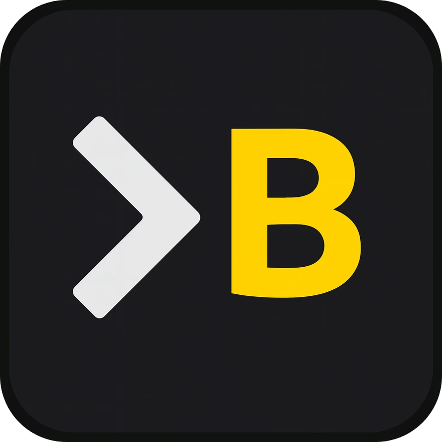

<h1 style="text-align:center" align="center">
    
    
BrunoTS.dev

</h1>

> **Software Engineer | Problem Solver | System Architect**

A minimalist personal website with terminal aesthetics, showcasing my work and expertise in software development.

## 🚀 About Me

I'm **Bruno**, a Software Engineer focused on **system resilience** and **high performance**. My passion is dissecting complex architectures and building clean, scalable solutions.

### 🛠️ Core Stack

- **Backend & Concurrency:** Laravel/PHP, Go
- **Data Systems:** PostgreSQL, Redis
- **Frontend:** Livewire, Vue.js, Tailwind CSS
- **Specialty:** Asynchronous systems and performance optimization

## 🎯 Featured Projects

- **[Purrai](https://github.com/b7s/purrai)** - AI Workflow Agent for complex task automation
- **[PHP Whisper Integration](https://github.com/b7s/whisper-php-binding)** - Native speech-to-text binding for PHP
- **[Parallite](https://github.com/b7s/parallite)** - Async multitasking library for PHP

## 🌐 Website

This repository contains the source code for my personal website, available at [brunots.dev](https://brunots.dev).

### Features

- ✨ Minimalist terminal-inspired design
- 🎨 Dynamic blue gradient with backdrop blur
- ⚡ Performance-optimized with requestAnimationFrame animations
- 📱 Fully responsive
- 🎭 Typing effect with rotating phrases

### Technologies

Just...

- HTML5
- Tailwind CSS (via CDN)
- Vanilla JavaScript
- Google Fonts (Inter + JetBrains Mono)

## 🔓 Open Source

This project is **open source** and available for anyone to use as inspiration or foundation for their own projects. Feel free to explore, learn, and adapt!

## 📫 Contact

- **Email:** [me@brunots.dev](mailto:me@brunots.dev)
- **GitHub:** [@b7s](https://github.com/b7s)
- **LinkedIn:** [/in/brunotenorios](https://www.linkedin.com/in/brunotenorios/)

---

**[brunots.dev](https://brunots.dev)** • Made with ☕ and clean code

## Certifications

Laravel Senior Certificate — [verify authenticity](https://verifier.certificationforlaravel.org/1c0b7ea2-89ac-4351-a58b-c399556e9839).
